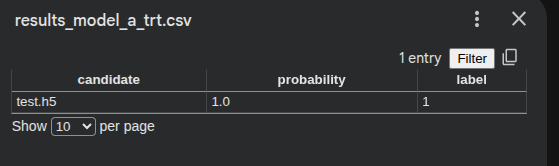

# FETCH -TensorRT V2  
This is the fetch fast radio burst detector in TensorRT version 2. The preliminary script for this repo can be found here :  [Link to github](https://github.com/aamod-wick/TENORRT-INTEGRATION-spotlight)  

-------
## Description 
This repo is based on converting FETCH-ONNX to an inference only pipeline optimised for NVIDIA GPUs.It predicts whether a given H5 image is likely a Fast Radio Burst or not .  
FETCH (Fast Extragalactic Transient Candidate Hunter) - ONNX Edition provides a lightweight, TensorFlow-free ONNX inference solution for fast radio burst (FRB) detection and classification.The original version of Fetch Onnx can be found here   [Link to github repo](https://github.com/devanshkv/fetch/tree/onnx)  

## Contents 

1. Quick start guide 
2. usage tutorials on colab notebook 
3. Sample support guide using raw code on colab notebooks
4. Known issues 
5. Command usage      
    
## 1. Quick start guide 
1.1. Clone the repo and cd into {fetch-V2} folder 
```bash 
git clone https://github.com/aamod-wick/fetch-V2.git
cd fetch-V2/
```
1.2. Install the requirements  of this project using pip
```bash 
pip install -r requirements.txt
```
**Note** : The lowest supported version is tensorrt-cu11==10.0.1 tensorrt-cu11-bindings==10.0.1 tensorrt-cu11-libs==10.0.1  
fetch-V2 is recommended for cuda 11+ python 3.8+ but can be operational for higher cuda 13 and 12 .

for example for downloading for a higher cuda change the version of the requirements as below :

```txt 
tensorrt-cu12==10.0.1
tensorrt-cu12-bindings==10.0.1
tensorrt-cu12-libs==10.0.1
```
**Note** : However fetch-V2 muyst be used at TensorRT ==10.0.1 for INT8 quantization . FP 16 and FP 32 can work with TensorRT versions >=10.1.0   
    
1.3. End user Workflow : Create an engine -> pass data files to inferer(trt_infer.py) in args->candidate result stored

1.4. Create an engine in Varying quantizations( FP 32 , FP 16 , INT 8)  
 For creating an engine refer to the colab sample suppor guide highlighting each command 

For FP32/FP16 : run file "buildengine-fp16.py" and For INT8 engine building run file :buildengine_common.py with documented arguments .
   
For example for creating an engine of FP 32 run this command 
```bash
python trt_infer.py --engine_name model_a --h5_folder /{path to fetch-V2 repo}/fetch-V2/tests/ --batch_size 4 --probability 0.5 --ft_dim 256 256 --dt_dim 256 256 --engine_suffix .engine
```  

This should give an output on the user terminal akin to this :- 
```txt
Input 'data_freq_time' with dynamic shape and dtype float32
Input 'data_dm_time' with dynamic shape and dtype float32
Output 'dense_3' with dynamic shape and dtype float32
Running inference on batch of 1 files

Inference complete — 1 candidates processed.
  test.h5  |  dense_3: [3.9158168e-10 1.0000000e+00]
Results saved to: /{path to fetch-V2 repo}/fetch-V2/tests/results_model_a_trt.csv
1 candidates processed, 1 detections above threshold 0.5
```
Morever the results _model_atrt.csv would contain the detection probablity and candidate file name in a comma seaparted value format like this : -  


## 2. usage tutorials on colab notebook
  Refer this colab note book to udnerstand how to run and use this project. [Link to usage tutorial](https://colab.research.google.com/drive/1Q0gBkk3KRZR6GiFXuC7d27oTgDAAzHFG?usp=sharing)

  Setup------------>Select "copy this notebook to drive"  
            |
            ------->Select "change runtime type"    
            |
            -------->Select a compliant gpu such as "T4 GPU"(free) or "A100 GPU"(paid)  
            |
            --------->Run the cells accordingly one by one to get the gist   
## 3. Sample support guide using raw code on colab notebooks
